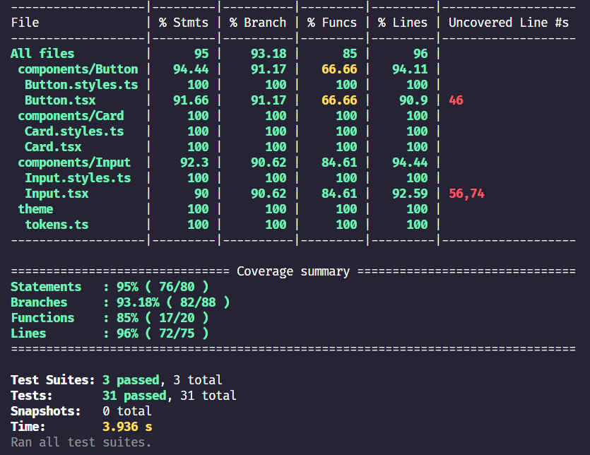

# UI Design System – Next.js

Design System moderno construido con **Next.js (App Router)**, **TypeScript**, **Tailwind CSS** y **Testing con Jest + React Testing Library**.  
Este proyecto centraliza componentes reutilizables, documentados y testeados, enfocados en escalabilidad, consistencia visual y buenas prácticas de frontend enterprise.

## Context

Este proyecto corresponde a una prueba técnica elaborada por:

**Jefferson Stiven Pulido Márquez**  
**FullStack Developer**  
**Grupo Bolívar – Davivienda**

El objetivo es demostrar:

- Diseño de componentes reutilizables
- Arquitectura limpia y escalable
- Buenas prácticas de testing
- Documentación técnica clara

## Tech Stack

- **Next.js 14** (App Router)
- **React 18**
- **TypeScript**
- **Tailwind CSS**
- **Jest**
- **React Testing Library**
- **ESLint**
- **Design Tokens**
- **Internal UI Documentation**

## Included Components

### Button
- Variants
- States (hover, disabled, loading)
- Custom colors

### Card
- Multiple sizes
- Optional image
- Dynamic actions
- Accent color support

### Input
- Text, Number, Password
- Textarea
- Select
- Validation states
- Focus, error and disabled states

Todos los componentes:

- Son tipados
- Son reutilizables
- Tienen tests unitarios
- Están documentados visualmente

## Project Structure

```txt
ui-design-system
├─ eslint.config.mjs
├─ jest.config.ts
├─ jest.setup.ts
├─ next.config.ts
├─ package.json
├─ README.md
├─ public
├─ src
│  ├─ app
│  │  ├─ components        # Documentation components
│  │  ├─ data              # Component docs definitions
│  │  ├─ hooks
│  │  ├─ interfaces
│  │  ├─ providers
│  │  ├─ layout.tsx
│  │  └─ page.tsx
│  └─ ui
│     ├─ components        # Design System
│     │  ├─ Button
│     │  ├─ Card
│     │  └─ Input
│     ├─ theme
│     │  └─ tokens.ts      # Design Tokens
│     └─ index.ts
├─ tailwind.config.js
└─ tsconfig.json

```

## Deployment

Para desplegar este proyecto:

```bash
  Clonar o descargar repositorio
```
```bash
  npm install
```
```bash
  npm run dev
```
## Test Coverage



## Production

https://technicaljp.vercel.app/

##

<h1 align="center">Hi 👋, I'm Jefferson Pulido</h1>
<h3 align="center">Soy un Desarrollador Web Full Stack, con conocimiento en tecnologías como PHP, Python, bases de datos, NodeJS, JavaScript, ReactJs y mas. Siempre al día en los lenguajes más demandados. Soy responsable, autónomo, autodidacta y líder, lo que me permite buscar las mejores soluciones a cualquier problema. Me encanta aprender de diferentes áreas y estoy seguro de que puedo contribuir al éxito de su empresa. ¡Trabajemos juntos para hacer realidad nuestros sueños!</h3>

<p align="center">  </p>
<h2 align="center">👨‍💻 All my projects and more information is available in my portfolio! https://jeffersonpulido.netlify.app</h2>

<h3 align="left">Connect with me:</h3>
<p align="left">
    <a href="https://linkedin.com/in/jeffersonpulido" target="blank"></a>
    <a href="https://github.com/JeffersonPulido" target="blank"></a>
</p>

## Authors

- [@JeffersonPulido](https://www.github.com/JeffersonPulido)
